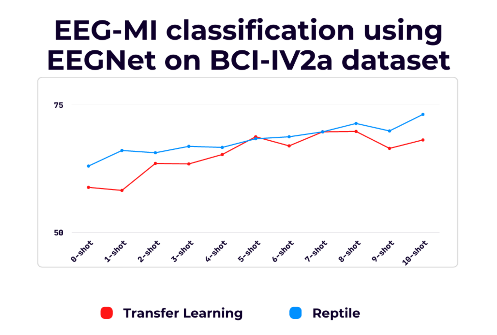

# A-Comparative-Study-of-Meta-Learning-vs.-Transfer-Learning-for-EEG-based-Brain-Computer-Interfaces
## 1. Motor Imagery
We wish to develop a model that can accurately classify motor imagery tasks for a new subject after fine tuning on a very few shots of data from the new subject. We can train the model appropriately on different train subjects, and using a meta learning approach can achieve a better accuracy with fewer shots.

However, we don't need to use meta learning if we can get the best possible performance with a normal transfer learning approach.

Now, for a motor imagery task, the best possible performance varies greatly on various subjects. This depends on how well the subjects perform the motor imagery task. We demonstate this on different motor imagery datasets.
### BCI COMPETITION IV Dataset 2a
This dataset has 9 subjects, numbered 1 to 9.

We show the performance of EEGNet on each of the subjects, by dividing the trials of each individual subject into train (80%), validation (10%) and test (10%) data.

Then, we show the performance of EEGNet for few shot classifaction by taking the test subject as $i$ and the other subjects as train subjects. We do this for each $i$ = 1 to 9.

### Results on subject 9:

